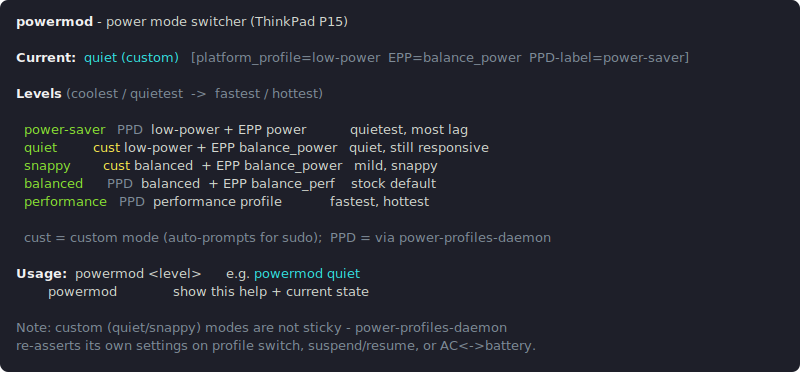

# powermod

A single power-mode switcher for a **Lenovo ThinkPad P15 Gen 2i** that
front-ends *both* [`power-profiles-daemon`](https://gitlab.freedesktop.org/upower/power-profiles-daemon)
(the three real profiles) **and** two custom “in-between” modes — giving one
ladder from quietest to fastest.



## Why it exists

On this machine `power-profiles-daemon` only changes two things between
`power-saver` and `balanced`:

| knob | balanced | power-saver |
|------|----------|-------------|
| `platform_profile` | balanced | low-power |
| **EPP** (energy/perf bias) | balance_performance | power |

It does **not** cap clock speed or power limits. The sluggishness of
`power-saver` is almost entirely the `EPP=power` setting (the CPU is reluctant
to ramp up clocks). The CPU’s EPP scale is:

```
performance → balance_performance → balance_power → power
                  ↑ balanced            ↑ the gap        ↑ power-saver
```

`balance_power` sits **exactly between** the two stock profiles. So the custom
modes keep a cool/quiet firmware envelope but set `EPP=balance_power` for a
willing ramp — quiet without the lag.

## The ladder (coolest/quietest → fastest/hottest)

| level | type | what it sets | feel |
|-------|------|--------------|------|
| `power-saver` | PPD | low-power + EPP `power` | quietest, most lag |
| `quiet` | custom | low-power + EPP `balance_power` | quiet, still responsive |
| `snappy` | custom | balanced + EPP `balance_power` | mild, snappy |
| `balanced` | PPD | balanced + EPP `balance_performance` | stock default |
| `performance` | PPD | performance profile | fastest, hottest |

## Install

One line, no clone needed, and re-running the same line updates an existing
install in place:

```bash
curl -fsSL https://raw.githubusercontent.com/mjfwebb/powermod/main/install.sh | bash
```

It installs to `~/.local/bin` (override with `POWERMOD_BIN_DIR`), which must be
on your PATH. Or, from a clone:

```bash
install -Dm755 powermod ~/.local/bin/powermod
```

powermod itself needs nothing beyond `bash` and `powerprofilesctl`
(`power-profiles-daemon`); the custom levels also use `sudo` to write sysfs.

## Usage

```bash
powermod                # show help + current state
powermod quiet          # custom mode (auto-prompts for sudo)
powermod snappy         # custom mode (auto-prompts for sudo)
powermod balanced       # real PPD profile (no sudo needed)
powermod power-saver
powermod performance
```

- **PPD levels** (`power-saver` / `balanced` / `performance`) go through
  `powerprofilesctl` — no root needed.
- **Custom levels** (`quiet` / `snappy`) write `platform_profile` and per-CPU
  `energy_performance_preference`, which need root — the script re-`exec`s
  itself under `sudo` automatically, so you just type `powermod quiet`.

With no argument (or `-h`/`--help`) powermod prints the ladder and the mode it
detects as currently active, decoded from the real `platform_profile` and EPP
knobs rather than the (possibly stale) PPD label. `powermod -V` prints the
version.

## Caveat: custom modes aren’t “sticky”

`power-profiles-daemon` remains the real manager. It re-asserts its own EPP
whenever you switch a profile, **suspend/resume, or change AC ↔ battery**, which
will undo a `quiet`/`snappy` setting. Re-run `powermod` after those events.

For a permanent, automatic custom profile (survives reboot and power events),
the proper tool is **TLP** — it replaces `power-profiles-daemon` and lets you
pin `balance_power` (plus exact frequency / PL1 / PL2 limits) per AC and
battery. Not installed here yet.

## Contributing

See [CONTRIBUTING.md](CONTRIBUTING.md) for dev setup, the test suite, linting,
and the release process.
